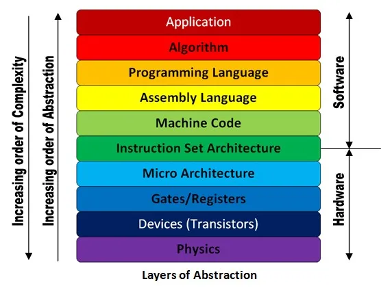

# Tenants

There are a couple of other (un)spoken tenants of computer
science that I think everyone in CS should know.

## Abstraction

Abstraction is one of the most useful ideas in computer science.
Abstraction is the idea that we can "abstract" details away so
that we can focus on the bigger picture. I always like this
picture [^ref1] that we've showed forever in intro to CS @ Mines:

For instance, it's useful to understand that computers are made
of [lots of transistors](https://www.cnet.com/tech/mobile/apple-a17-pro-the-new-chip-brain-in-the-iphone-15-pro-pro-max/).
And those transistors have a lot of physics things going on too [^ref2].

Do I need to understand every element of how a transistor works in
order to be able to program? Definitely not. And I definitely don't.
Do I need to understand gates and registers to write an algorithm? No.
But it is useful to know how things work, and then work your way up and
disregard or postpone the details of things that don't matter as much
on the "level" that you're at.

The more you see abstraction (which arguably is not limited to the
realm of computer science or engineering), the better you can communicate
complex things. If you understand the big picture, you can explain as much,
and then when you need to get into the details, you've got that locked away
in your memory too, ready to go.

## The wheel

**Don't reinvent the wheel**, unless the wheels are flat or square [^ref3].
Now, maybe there's a case for reinventing the wheel while you're learning.
Software engineering students at Mines have forever been succombed to making
the board game Clue, but it's good practice.

When you get out into industry, you probably won't be reinventing the wheel,
but this expression goes beyond that.

If there's a library/framework/API/whatever out there that does what you need,
**use it!** Don't fall into the trap of remaking everything yourself because
you think you'll do it better (I do this all of the time, and I shouldn't).

Now, if the wheels are flat - maybe that library did good at one point but isn't
headed in the right direction, or maybe it's not updated - knock yourself out,
make it better. Maybe the wheels are square: they're serving a purpose, but they're
not *really* working.

## Overthinking & perfectionism

**Don't overthink it**. This is just good life advice, nonetheless CS advice.
I think a lot of us are heavy thinkers and think about worst case behavior (which
is good practice for finding edge cases), and we're always overthinking things.

If you're a perfectionist like me, it's also hard to let things go. I feel like I
can always do a better job, but at some point you've got to finish the assignment
or ship the product.

Do a good job and a passable job, and then maybe you'll get a second chance to
get it perfect in the future. Codebases change and technologies change so quickly
that your code might be obsolete; code was only ever just code, you can always
write more of it. No need to freak out about it.

If you're unable to stop overthinking or being a perfectionist about things, that's
okay! It shows how much you care about whatever it is you're doing. But maybe talk
to someone else to get their perspective on things and move forward from there.

## Symptoms and causes

**Treat the cause, not the symptom**. This is a classic software
engineering saying. Just like with an illness, if you treat the symptom,
it might get better temporarily, but the illness will probably come back.

To be fair, sometimes you *can't* treat the cause. Maybe someone made
an architectural decision that prevents it and would cost literally millions
of dollars and months of time to change. That's okay: you have to work around it.
Hopefully you or your senior engineers are looking out for these patterns and
can weigh the tradeoff of rewriting a codebase for the 5th time versus just
sticking with it.

But if you can treat the cause, do it. And do it early before it develops
throughout your code. If you have a bad API or even a poorly designed function,
and it gets used everywhere, you now need to convince the users to change and
you yourself need to do a ton of refactoring [^ref4].

[^ref1]: Credit to [Ishan Bhanuka on Medium](https://medium.com/@twitu/a-dive-down-the-levels-of-abstraction-227c96c7933c)

[^ref2]: I got a pretty bad grade in physics, that's about as clear as I can be.

[^ref3]: Credit to Sumner for this quote. :)

[^ref4]: Hence why we have the lovely aforementioned [Refactoring Guru](https://refactoring.guru).
