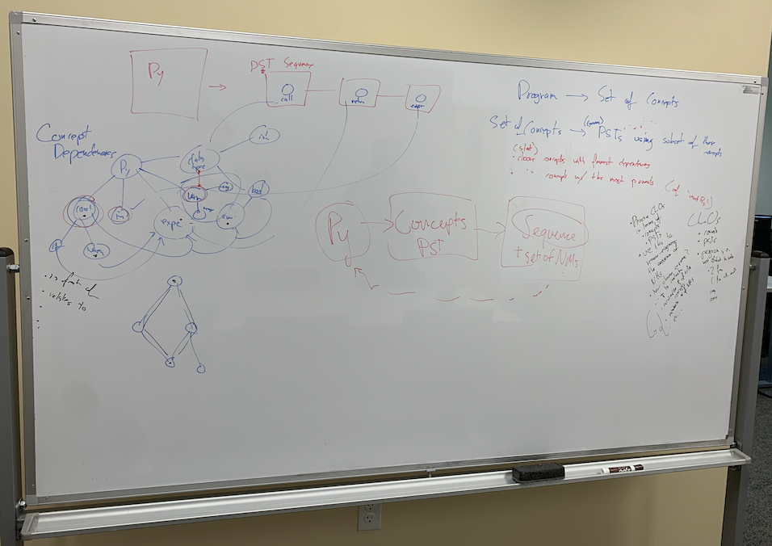
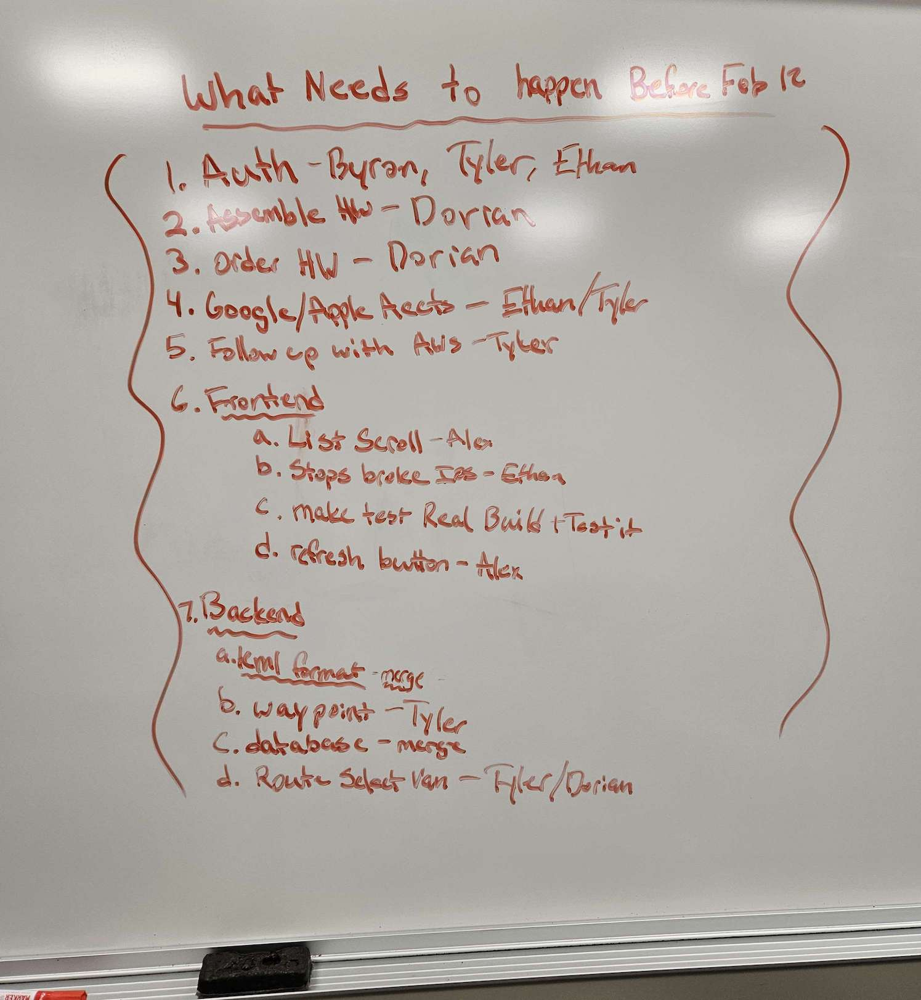

# Planning

This might seem like the most obvious section of this entire book.
But I think you would be surprised at just how *little* people actually
plan what they're doing. I think these habits often come from academia:
for the most part, you get an assignment, you get an idea of how to code
it, and you just go ahead and code it. Or, even if you want to plan,
time constraints can make it feel like it's not worth your time.

Part of the issue which I noticed in industry is Agile. Agile has
its strengths, but I feel like a good old fashioned planning session or
design document is lost with Agile; it's all about that next ticket and
how many points it's worth [^ref1] without considering the bigger picture [^ref2].
Time spent planning is time well spent, even when churning out features
and tickets is the priority.

## Drawing it out

Whenever I'm faced with a problem, I give it an honest attempt and then
immediately *after* I draw it out or write out what I'm trying to do if it
doesn't work. Yes, I am guilty of not planning up front either.

I've noticed this quality in a lot of high-functioning professors, PhD students,
engineers, and more. They're *always* drawing things out and trying to understand things
in their head. You don't have to be a good artist to do this. The best sketches
come in the form of scratchy, messy, incoherent writings on whatever napkin or
paper is nearby. Or, if your school or company has a ton of whiteboards nearby, use them!

Writing things out can be in the moment. It can be ahead of a big project. It
can be a reflective process after-the-fact. Regardless, it helps to get out
of our heads once in awhile.

As an aside, I certainly hope you're drawing it out if you're in the realm of
frontend/UI/UX design. Open up Figma or just go "old fashioned" with
some pen and paper. You should plan for how things are actually going to
be used and test it a lot.

## Commenting

Often times, when I plan: *the code writes itself*. I find people's use of
[GitHub Copilot](https://github.com/features/copilot) pretty funny, as normally people
don't comment code that well. But when you're trying to tell the genAI what
you're going for, you tend to explain yourself a little better and more clearly
until it gets the right code that you're looking for. It's the same idea:
if you outline your code, you (or AI) can write it pretty quickly. I'll have
an entire section on commenting coming right up.

## Gallery

*A whiteboard plan I worked on with my research advisor.*

*A whiteboard brainstorm of the upcoming tasks for the OreCart project.*

[^ref1]: Don't get me started on pointing.

[^ref2]: Yes, the more senior engineers are considering the bigger picture,
but I feel like us lowly junior-engineer-bug-fixers are often not involved 
in that when it can actually be really important if not useful to learn.
